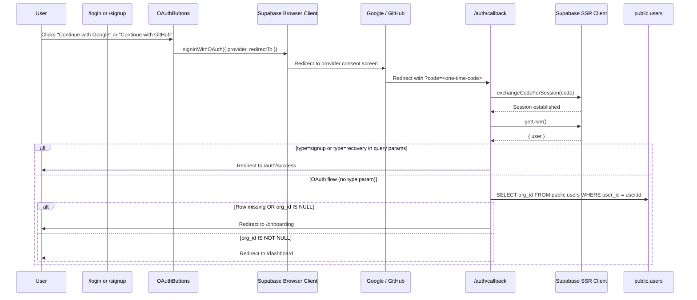

# Design Document

## Overview

This document describes the technical design for adding Google and GitHub OAuth sign-in to the Qavro enterprise UI (`omnis-ui`). The feature introduces a shared `OAuthButtons` React client component that is rendered on both the `/login` and `/signup` pages. The existing Supabase auth callback route (`/auth/callback/route.ts`) is updated to distinguish email-confirmation flows (which continue to land at `/auth/success`) from OAuth flows (which are routed to `/onboarding` or `/dashboard` based on the user's `org_id` in `public.users`).

No existing email/password authentication logic is modified. The middleware (`proxy.ts`) is untouched. All secrets are sourced exclusively from `process.env` in compliance with the architecture constitution.

---

## Architecture

### High-Level Flow



### Component Boundaries

| Layer | Component | Client/Server | Supabase Client |
|---|---|---|---|
| Auth UI | `OAuthButtons` | Client (`"use client"`) | `createClient()` from `utils/supabase/client` |
| Auth UI | `app/login/page.tsx` (existing `AuthForm`) | Client | `createClient()` (unchanged) |
| Auth UI | `app/signup/page.tsx` (existing `SignUpForm`) | Client | `createClient()` (unchanged) |
| Auth Callback | `app/auth/callback/route.ts` | Server Route | `createServerClient` from `@supabase/ssr` |
| Middleware | `proxy.ts` | Edge Middleware | `createServerClient` (unchanged, not modified) |

---

## Components and Interfaces

### 1. `OAuthButtons` (`components/auth/OAuthButtons.tsx`)

**New file.** A pure client component with no required props.

```typescript
"use client";

// Props: none required
// Internal state:
//   loadingProvider: 'google' | 'github' | null
//   error: string | null

interface OAuthButtonsProps {}
```

**Responsibilities:**
- Render "Continue with Google" button with inline Google SVG brand icon (4-color: `#4285F4` / `#34A853` / `#FBBC05` / `#EA4335`).
- Render "Continue with GitHub" button with monochrome Invertocat SVG (`fill="currentColor"` + `text-slate-900`).
- On click, call `supabase.auth.signInWithOAuth({ provider, options: { redirectTo: \`${process.env.NEXT_PUBLIC_SITE_URL}/auth/callback\` } })`.
- Track `loadingProvider` state; while loading, show spinner on the active button and disable both buttons.
- On Supabase error, store in `error` state and render inline error alert below the buttons.
- Render an "OR" divider (horizontal rule with centered "OR" label) below the buttons, visually separating the OAuth section from the email/password form that follows in the parent.

**Styling constraints (light-mode locked):**
- Buttons: `w-full`, `flex items-center justify-center gap-3`, `border border-gray-200`, `rounded-md`, `shadow-sm`, `bg-white`, `text-gray-800`, `font-medium`, `py-2.5`, `transition-colors`, `hover:bg-gray-50`.
- No `dark:` Tailwind variants anywhere in the file.
- Buttons visually distinct from the primary `bg-slate-900` submit button.

### 2. `app/login/page.tsx` — `AuthForm` update

**Modified file (minimal).** Import `OAuthButtons` and render it inside `AuthForm`, after the compliance pill and before the `<form>` block.

```tsx
// Inside AuthForm render, between the compliance pill and <form>:
<OAuthButtons />

// Existing <form onSubmit={handleSubmit}> block — UNTOUCHED
```

No other changes to `AuthForm`, `BrandPanel`, or `LoginPage`.

### 3. `app/signup/page.tsx` — `SignUpForm` update

**Modified file (minimal).** Import `OAuthButtons` and render it inside `SignUpForm`, after the compliance pill and before the `<form>` block.

```tsx
// Inside SignUpForm render, between the compliance pill and <form>:
<OAuthButtons />

// Existing <form onSubmit={handleSubmit}> block — UNTOUCHED
```

No other changes to `SignUpForm`, `BrandPanel`, or `SignUpPage`.

### 4. `app/auth/callback/route.ts` — flow-type branching

**Modified file.** The existing route already handles `exchangeCodeForSession` and `getUser()` with correct error handling. The update adds:

1. After `getUser()` succeeds, read the `type` query parameter from the request URL.
2. If `type === 'signup'` or `type === 'recovery'`, redirect to `${origin}/auth/success` (preserves existing email-confirmation behavior).
3. Otherwise, query `public.users` for `org_id`:
   - Row missing OR `org_id IS NULL` → redirect to `${origin}/onboarding`.
   - `org_id` non-null → redirect to `${origin}/dashboard`.

The existing `exchangeCodeForSession` error path and `getUser()` error path are **not weakened**.

---

## Data Models

### `public.users` query (callback route)

The callback route performs a single server-side query after session establishment:

```sql
SELECT org_id
FROM public.users
WHERE user_id = <user.id from getUser()>
```

The route uses the Supabase SSR client (`createServerClient`). Identity (`user.id`) is derived exclusively from the session JWT via `getUser()`, never from URL parameters.

**Schema reference** (from architecture constitution):
```sql
CREATE TABLE users (
    user_id UUID PRIMARY KEY,
    org_id  UUID REFERENCES organizations(org_id) ON DELETE CASCADE,
    ...
);
```

Note: The current schema has `org_id NOT NULL` at the DDL level, but the application layer treats `org_id IS NULL` as a pending state (consistent with the `proxy.ts` onboarding gate and deferred profile creation trigger in the migrations). The query result may also return no row for a first-time OAuth user whose profile row hasn't been created yet.

**Routing decision table:**

| `public.users` query result | Redirect destination |
|---|---|
| Row exists, `org_id` is non-null UUID | `/dashboard` |
| Row exists, `org_id` is null | `/onboarding` |
| No row found (first OAuth login) | `/onboarding` |

### `OAuthButtons` internal state

No persistent state. All state is ephemeral React component state:

```typescript
const [loadingProvider, setLoadingProvider] = useState<'google' | 'github' | null>(null);
const [error, setError] = useState<string | null>(null);
```

No tokens, credentials, or session data are written to `localStorage`, `sessionStorage`, or the DOM.

---

## Correctness Properties

*A property is a characteristic or behavior that should hold true across all valid executions of a system — essentially, a formal statement about what the system should do. Properties serve as the bridge between human-readable specifications and machine-verifiable correctness guarantees.*

### Property 1: redirectTo URL construction is universal

*For any* valid string value of `NEXT_PUBLIC_SITE_URL` and for any supported provider (`google` or `github`), clicking the corresponding OAuth button must call `supabase.auth.signInWithOAuth` with a `redirectTo` value equal to `<NEXT_PUBLIC_SITE_URL>/auth/callback` — with no double-slash, no trailing slash artifact, and no hardcoded domain.

**Validates: Requirements 4.1, 4.2, 4.3, 4.4**

### Property 2: Inline error display for any Supabase error

*For any* error string returned by `supabase.auth.signInWithOAuth`, the `OAuthButtons` component must render that error message text in a visible inline element accessible to the user — regardless of the error content, length, or provider that triggered it.

**Validates: Requirements 2.4**

### Property 3: Callback route routing is determined exclusively by org_id

*For any* authenticated user returned by `getUser()` after a successful code exchange (and for any request not carrying `type=signup` or `type=recovery`), the redirect destination of the Auth_Callback_Route must be determined solely by the `org_id` value in `public.users`:
- If the row is absent or `org_id` is null → `/onboarding`
- If `org_id` is a non-null UUID (any UUID value) → `/dashboard`

No URL parameter (including `next`, `user_id`, `email`, or `org_id` in the query string) may influence this decision.

**Validates: Requirements 5.2, 5.3, 5.4, 5.5, 5.6, 7.1**

### Property 4: Email-confirmation flow is preserved for all type signals

*For any* callback request that includes a `type` query parameter equal to `signup` or `recovery`, the Auth_Callback_Route must redirect to `/auth/success` — regardless of the user's `org_id`, the code value, or any other query parameter. For any callback request where `type` is absent or holds any other value, the org_id routing logic (Property 3) applies.

**Validates: Requirements 6.1, 6.2, 6.3**

---

## Error Handling

### `OAuthButtons` component

| Condition | Behavior |
|---|---|
| `signInWithOAuth` returns `error` | Set `error` state; render inline alert (`border-red-200 bg-red-50`) with `AlertCircle` icon below buttons; clear `loadingProvider` |
| `signInWithOAuth` returns no error | Browser follows redirect to provider — component unmounts naturally |
| Both buttons disabled during loading | `disabled={!!loadingProvider}` on both; spinner shown on active button |

Error display uses the same alert pattern already used by `AuthForm` and `SignUpForm`:
```tsx
<div className="flex items-start gap-2.5 rounded-lg border border-red-200 bg-red-50 px-3.5 py-3">
  <AlertCircle className="mt-0.5 h-3.5 w-3.5 shrink-0 text-red-500" />
  <p className="text-xs leading-relaxed text-red-700">{error}</p>
</div>
```

### Auth callback route

| Condition | Behavior |
|---|---|
| No `code` param | Redirect to `/login` (existing behavior, unchanged) |
| `exchangeCodeForSession` fails | Redirect to `/login?error=auth_callback_failed` (existing, unchanged) |
| `getUser()` returns no user | Redirect to `/login?error=session_not_established` (existing, unchanged) |
| `type=signup` or `type=recovery` | Redirect to `/auth/success` (email flow preservation) |
| `users` query returns no row | Treat as `org_id IS NULL`, redirect to `/onboarding` |
| `users` query returns `org_id = null` | Redirect to `/onboarding` |
| `users` query returns non-null `org_id` | Redirect to `/dashboard` |

All server-side console errors continue to be logged with `[auth/callback]` prefix for observability.

---

## Testing Strategy

### Test framework

The project uses Next.js 16 with React 19. The recommended test stack is **Vitest** with **@testing-library/react** for component tests, and Vitest for route handler unit tests with mocked Supabase clients. No test framework is currently present in `package.json`; add `vitest`, `@vitejs/plugin-react`, `@testing-library/react`, and `@testing-library/user-event` as `devDependencies`.

Property-based testing uses **fast-check** (the standard PBT library for TypeScript/JavaScript projects).

### Unit / example tests

These verify specific scenarios with concrete inputs:

- **OAuthButtons rendering**: Render component, assert Google button text, GitHub button text, and "OR" divider are present.
- **OAuthButtons styling**: Assert `bg-white`, `text-gray-800`, `border border-gray-200`, and absence of `dark:` in rendered class strings.
- **OAuthButtons loading state**: Mock `signInWithOAuth` to never resolve; click Google button; assert spinner present, both buttons disabled.
- **Login/Signup page composition**: Render each page, assert `OAuthButtons` is positioned before the `<form>` block in the DOM.
- **Login form preservation**: Submit login form with mocked Supabase; assert `signInWithPassword` called with email/password; assert error display on failure.
- **Signup form preservation**: Submit with mismatched passwords; assert error message. Submit with short password; assert error message.
- **Callback — email flow**: Simulate GET request with `?code=x&type=signup`; mock successful exchange and getUser; assert redirect to `/auth/success`.
- **Callback — error paths**: Mock `exchangeCodeForSession` failure; assert redirect to `/login?error=auth_callback_failed`. Mock `getUser` returning null; assert redirect to `/login?error=session_not_established`.

### Property-based tests

Each property test runs a minimum of **100 iterations**. Tag format in code:
```
// Feature: oauth-social-login, Property N: <property text>
```

**Property 1 — redirectTo URL construction:**
```
// Feature: oauth-social-login, Property 1: redirectTo URL construction is universal
```
Generate arbitrary base URL strings (with/without trailing slash, various valid origins). For each:
- Mock `createClient()` to capture `signInWithOAuth` arguments.
- Set `NEXT_PUBLIC_SITE_URL` to the generated URL.
- Simulate button click for both providers.
- Assert `redirectTo === normalizedBase + '/auth/callback'` with no double-slash.

**Property 2 — Inline error display for any Supabase error:**
```
// Feature: oauth-social-login, Property 2: Inline error display for any Supabase error
```
Generate arbitrary non-empty error message strings. For each:
- Mock `signInWithOAuth` to return `{ data: {}, error: { message: generatedString } }`.
- Simulate button click.
- Assert the rendered component contains the generated error string in a visible element.

**Property 3 — Callback routing determined exclusively by org_id:**
```
// Feature: oauth-social-login, Property 3: Callback route routing is determined exclusively by org_id
```
Generate arbitrary UUID strings (for non-null org_id cases) and null/undefined (for null cases). For each:
- Mock `exchangeCodeForSession` to succeed.
- Mock `getUser()` to return a user with a random user ID.
- Mock `public.users` query to return the generated org_id (or no row).
- Assert redirect is `/onboarding` for null/absent, `/dashboard` for any non-null UUID.
- Also generate arbitrary `?next=` param values and assert they never appear in the redirect.

**Property 4 — Email-confirmation flow preserved for all type signals:**
```
// Feature: oauth-social-login, Property 4: Email-confirmation flow is preserved for all type signals
```
Generate arbitrary `type` param values. For each:
- Mock successful exchange and getUser.
- If generated value is `signup` or `recovery`: assert redirect to `/auth/success`.
- Otherwise: assert redirect is `/onboarding` or `/dashboard` per org_id, never `/auth/success`.

### Integration tests (manual / E2E)

These are not suitable for property-based testing (they exercise external OAuth provider behavior and live Supabase infrastructure):

- Configure Google OAuth app in Supabase dashboard; perform a real Google sign-in in a browser; verify session cookie is set and user lands on `/onboarding` (new user) or `/dashboard` (returning user).
- Configure GitHub OAuth app in Supabase dashboard; perform a real GitHub sign-in; verify same routing.
- Trigger an email confirmation link for a regular signup; verify it still lands on `/auth/success`.

### Smoke checks (static / code review)

- `OAuthButtons.tsx` starts with `"use client"`.
- No `dark:` Tailwind prefix in `OAuthButtons.tsx`.
- No hardcoded URLs or secrets in `OAuthButtons.tsx`.
- `app/auth/callback/route.ts` uses `createServerClient`, not `createBrowserClient`.
- `proxy.ts` file hash is unchanged.
