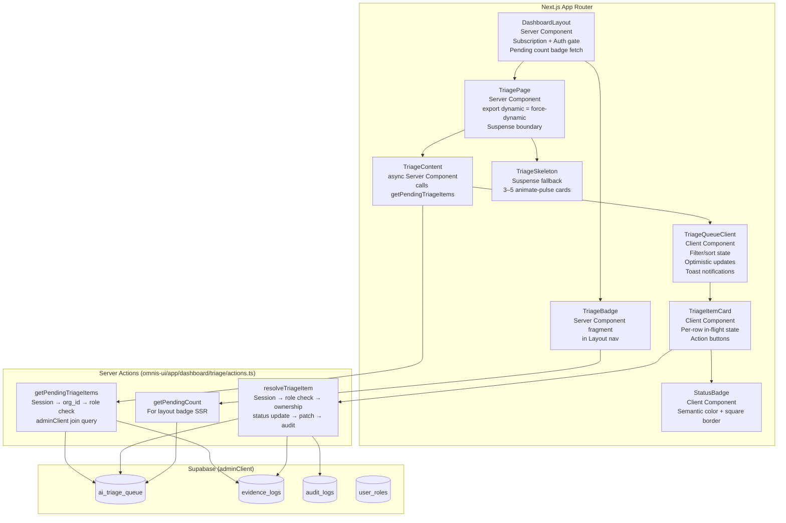

# Design Document: Triage Inbox Resolution

## Overview

The Triage Inbox Resolution feature is the human review layer of the QAVRO Omnis RegOps compliance engine. It exposes a production-grade inbox at `/dashboard/triage` where QA Managers and Admins review AI-flagged `req_id` discrepancies on evidence logs, resolve them (approve or reject), and generate immutable 21 CFR Part 11 audit records for every decision.

The feature builds directly on top of three existing foundations:
- `public.ai_triage_queue` — the database ledger for AI-flagged discrepancies
- `public.audit_logs` — the append-only 21 CFR Part 11 audit trail
- `resolveTriageItem` Server Action — the existing write executor in `omnis-ui/app/dashboard/triage/actions.ts`

The primary design concerns are: (1) correctness of the two-write atomic resolution sequence, (2) org-scoped data isolation via the `evidence_logs` join pattern, (3) role-gated access at both UI and server layers, (4) optimistic UI state management with graceful failure recovery, and (5) strict QAVRO dark-canvas design system compliance.

---

## Architecture

The feature follows the standard Next.js App Router pattern for QAVRO: a Server Component page streams pre-fetched data into a Client Component that owns all interactive state.




### Key Architectural Decisions

**Server Component page with Client Component shell.** The page fetches initial data server-side (avoiding client-side loading flash for primary content) and passes it to `TriageQueueClient` as `initialItems`. All subsequent state changes (optimistic removes, filter changes, sort changes) happen entirely in client state without re-fetching from the server — `revalidatePath` refreshes the server cache for the next navigation.

**`adminClient` in Server Actions, not the user-scoped client.** The user-scoped client is subject to RLS policies, which correctly gate SELECT to org members. However, the `resolveTriageItem` action uses `adminClient` so it can join `ai_triage_queue → evidence_logs` and apply `UPDATE` writes without the RLS UPDATE policy interfering — org scoping is instead enforced explicitly via query predicates (`.eq("evidence_logs.org_id", orgId)`). This is defence-in-depth: the server-side role check is the authoritative gate; the explicit org predicate is a second layer.

**Force-dynamic.** `export const dynamic = "force-dynamic"` is required on the triage page so every request re-runs the Server Action and reflects resolutions made by other reviewers. Without this, Next.js would serve a cached server render showing stale queue state.

**Optimistic updates with rollback.** When a reviewer dispatches an action, the item is removed from `TriageQueueClient`'s local state immediately. If the Server Action returns `success: false`, the item is restored at the head of the list and an error toast is shown. This prevents the perceived latency of waiting for a Server Action round-trip before the UI responds.

---

## Components and Interfaces

### File Structure

```
omnis-ui/app/dashboard/triage/
├── page.tsx                    # Server Component page (force-dynamic, Suspense boundary)
├── actions.ts                  # Server Actions: getPendingTriageItems, resolveTriageItem, getPendingCount

omnis-ui/components/
├── triage-queue-client.tsx     # TriageQueueClient (filter/sort/toast/optimistic state)
├── triage-item-card.tsx        # TriageItemCard (per-row display + action buttons)
├── triage-skeleton.tsx         # TriageSkeleton (3–5 animate-pulse placeholder cards)
├── triage-status-badge.tsx     # StatusBadge (PENDING/APPROVED/REJECTED semantic badge)
├── triage-badge.tsx            # TriageBadge (nav badge showing pending count for layout)
```


### Component Interfaces

```typescript
// TriagePage (Server Component)
// omnis-ui/app/dashboard/triage/page.tsx
// No props — fetches all data internally via Server Actions.
export default async function TriagePage(): Promise<JSX.Element>

// TriageContent (async Server Component inside Suspense)
// Calls getPendingTriageItems, handles error banner, renders TriageQueueClient.
async function TriageContent(): Promise<JSX.Element>

// TriageSkeleton (Server/Client Component — no state)
// Renders 3 skeleton placeholder cards matching TriageItemCard dimensions.
function TriageSkeleton(): JSX.Element

// TriageQueueClient (Client Component)
interface TriageQueueClientProps {
  initialItems: AiTriageQueueRow[];
  viewerRole: "qa_manager" | "admin" | "developer"; // passed from server for UI gate
}
export function TriageQueueClient(props: TriageQueueClientProps): JSX.Element

// TriageItemCard (Client Component)
interface TriageItemCardProps {
  item: AiTriageQueueRow;
  isInFlight: boolean;                              // true while action is pending
  isViewerOwned: boolean;                           // true if developer viewing their own item
  onApprove: (id: string) => void;
  onReject: (id: string) => void;
}
export function TriageItemCard(props: TriageItemCardProps): JSX.Element

// TriageStatusBadge (Client Component)
interface TriageStatusBadgeProps {
  status: "pending" | "approved" | "rejected";
}
export function TriageStatusBadge(props: TriageStatusBadgeProps): JSX.Element

// TriageBadge (Server Component fragment — rendered in DashboardLayout nav)
interface TriageBadgeProps {
  count: number;     // already-fetched pending count (0 = do not render)
  role: string;      // badge only renders for admin/qa_manager
}
export function TriageBadge(props: TriageBadgeProps): JSX.Element | null
```

### Server Action Signatures (updated/extended from existing)

```typescript
// omnis-ui/app/dashboard/triage/actions.ts

// Existing — fetch pending items for the authenticated user's org.
export async function getPendingTriageItems(): Promise<GetPendingTriageResult>

// Existing — resolve a triage item (approve or reject).
export async function resolveTriageItem(
  id: string,
  resolution: TriageStatus,
): Promise<ResolveTriageResult>

// New — fetch the pending count for the badge in the dashboard layout.
// Used by DashboardLayout during SSR; does not require admin/qa_manager role
// (the caller should not render the badge for developer/viewer roles).
export async function getPendingCount(): Promise<{ count: number; error?: string }>

// Extended return type for resolveTriageItem
export interface ResolveTriageResult {
  success: boolean;
  error?: string;
  // Added: surface the suggested_req_id for the success toast message
  suggestedReqId?: string;
  originalReqId?: string;
}
```

---

## Data Models

### Primary Query: Load Triage Queue (org-scoped)

The org-scoping challenge: `ai_triage_queue` has no direct `org_id` column. The org boundary is established through the join to `evidence_logs`, which carries `org_id`. The query joins through this relationship.

```typescript
// In getPendingTriageItems — admin/qa_manager path
const { data, error } = await adminClient
  .from("ai_triage_queue")
  .select(`
    id,
    evidence_log_id,
    original_req_id,
    suggested_req_id,
    ai_reasoning,
    status,
    created_at,
    evidence_logs!inner ( org_id, user_id )
  `)
  .eq("status", "pending")
  .eq("evidence_logs.org_id", orgId)
  .order("created_at", { ascending: true });

// Developer path (additional user_id filter)
  .eq("evidence_logs.user_id", userId)   // added for developer scope
```

The `evidence_logs!inner` join is critical — using `!inner` ensures rows with no matching evidence log are excluded (avoids orphaned triage items appearing). Both `org_id` and `user_id` are stripped from the returned items before passing to the client to avoid leaking internal join data.


### Filtering and Sorting Query (Client-Side)

Filtering and sorting are applied client-side over `initialItems` because the full data set is small (organization-scoped pending queue) and a client-side filter avoids a Server Action round-trip on every filter change. The `TriageQueueClient` applies the filter and sort in a derived computed value:

```typescript
// Inside TriageQueueClient
type StatusFilter = "all" | "pending" | "approved" | "rejected";
type SortOrder = "oldest_first" | "newest_first";

// Derived display list — computed on every render, no extra state needed
const displayItems = useMemo(() => {
  let filtered = statusFilter === "all"
    ? items
    : items.filter((i) => i.status === statusFilter);

  return [...filtered].sort((a, b) => {
    const diff = new Date(a.created_at).getTime() - new Date(b.created_at).getTime();
    return sortOrder === "oldest_first" ? diff : -diff;
  });
}, [items, statusFilter, sortOrder]);
```

Since `initialItems` only contains `pending` items from the server fetch, switching the filter to `approved` or `rejected` will show an empty list unless the user has resolved items during this session. The design intentionally keeps things simple: a "View resolved items" use case can be addressed in a future enhancement with a separate server fetch.

### Pending Count Query (Badge)

```typescript
// In getPendingCount — called from DashboardLayout
const { count, error } = await adminClient
  .from("ai_triage_queue")
  .select("id, evidence_logs!inner ( org_id )", { count: "exact", head: true })
  .eq("status", "pending")
  .eq("evidence_logs.org_id", orgId);
```

Using `{ count: "exact", head: true }` returns a count without fetching row data — optimal for the badge fetch which only needs the integer.

### Resolution Write Sequence

The two-write sequence in `resolveTriageItem` follows this order with explicit failure handling at each step:

```
1. FETCH  triage row + evidence_logs.org_id (ownership verification)
   ↓ FAIL → return error (no writes)
2. CHECK  status === 'pending'
   ↓ FAIL → return "already resolved" error (no writes)
3. UPDATE ai_triage_queue SET status = resolution WHERE id = $id
   ↓ FAIL → return error (no writes committed)
4. UPDATE evidence_logs SET req_id = suggested_req_id (approve path only)
   ↓ FAIL → return "partial failure" error (status is 'approved', log not patched — notify admin)
5. INSERT audit_logs (TRIAGE_RESOLVE, with before/after snapshot)
   ↓ FAIL → CRITICAL console log, return error
   Note: This is the atomicity gap in the current implementation.
         Step 3 cannot be rolled back if step 5 fails, because Supabase's
         REST client does not expose DDL transactions from the app layer.
         The mitigation is: step 5 failure is logged as CRITICAL and surfaced
         as a server error to the caller, who can retry. The triage row's
         'approved'/'rejected' status acts as a manual reconciliation signal.
         Future enhancement: wrap steps 3+4+5 in a Postgres function via .rpc().
6. revalidatePath("/dashboard/triage") — refreshes server cache for next nav
```

### Audit Log Schema for TRIAGE_RESOLVE

```typescript
// Before snapshot (Requirement 7.4)
const before = {
  triage_id: id,                           // ai_triage_queue.id
  status: "pending",
  original_req_id: evidenceLog.req_id,     // evidence_logs.req_id at call time
};

// After snapshot (Requirement 7.5)
const after = resolution === "approved"
  ? {
      resolution: "approved",
      resolved_by: userId,
      req_id_updated_to: triageRow.suggested_req_id,
    }
  : {
      resolution: "rejected",
      resolved_by: userId,
      req_id_updated_to: null,             // explicit null for reject
    };
```

Note: the `original_req_id` in the before snapshot is fetched from `evidence_logs.req_id` at Server Action execution time (not from `ai_triage_queue.original_req_id`), ensuring the audit captures the actual state of the evidence log at the moment of resolution — not the cached original value from when the triage item was created.


### State Management in TriageQueueClient

```typescript
// State owned by TriageQueueClient
const [items, setItems] = useState<AiTriageQueueRow[]>(initialItems);
const [inFlight, setInFlight] = useState<Set<string>>(new Set()); // item IDs with pending actions
const [statusFilter, setStatusFilter] = useState<StatusFilter>("all");
const [sortOrder, setSortOrder] = useState<SortOrder>("oldest_first");

// Optimistic resolution flow:
function handleResolve(id: string, resolution: "approved" | "rejected") {
  if (inFlight.has(id)) return;                    // double-click guard
  
  const item = items.find((i) => i.id === id)!;
  setInFlight((s) => new Set(s).add(id));          // disable buttons
  setItems((prev) => prev.filter((i) => i.id !== id)); // optimistic remove

  startTransition(async () => {
    const result = await resolveTriageItem(id, resolution);
    setInFlight((s) => { const n = new Set(s); n.delete(id); return n; });

    if (!result.success) {
      setItems((prev) => [item, ...prev]);         // restore on failure
      addToast("error", result.error ?? "Resolution failed.");
    } else {
      addToast("success", buildSuccessMessage(resolution, result));
      moveFocusAfterRemoval(id);                   // Req 12.8 focus management
    }
  });
}
```

The `inFlight` Set tracks item IDs currently being resolved. This prevents double-clicks, disables both action buttons during resolution, and prevents race conditions where a reviewer clicks both Approve and Reject before the first response returns.

---

## Correctness Properties

*A property is a characteristic or behavior that should hold true across all valid executions of a system — essentially, a formal statement about what the system should do. Properties serve as the bridge between human-readable specifications and machine-verifiable correctness guarantees.*

### Property 1: Org and User Isolation for Reads

*For any* authenticated user, calling `getPendingTriageItems` must return only triage items whose associated `evidence_logs.org_id` matches the caller's `org_id`. For a Developer caller, the result must be further restricted to items whose `evidence_logs.user_id` matches the caller's `user_id`. No item from another org or another developer's logs may appear in the result.

**Validates: Requirements 1.1, 1.5**

### Property 2: Sort Order Invariant

*For any* non-empty list of triage items with arbitrary `created_at` values, applying "Oldest First" sort must produce a list in non-decreasing `created_at` order, and applying "Newest First" sort must produce a list in non-increasing `created_at` order. The default sort (initial server fetch) must be equivalent to "Oldest First."

**Validates: Requirements 1.2, 9.4**

### Property 3: Error Messages Never Expose Raw Database Error Details

*For any* error returned by the Supabase client (including error codes, constraint violation messages, stack traces, or raw PostgreSQL error text), the string rendered to the user in the error banner must not contain PostgreSQL error codes (e.g., `23505`, `42P01`), raw error messages from Supabase, or JavaScript stack traces. The rendered message must be a user-safe string defined in the application code.

**Validates: Requirement 1.4**

### Property 4: Card Renders All Required Fields Correctly for Any Triage Item

*For any* `AiTriageQueueRow` with arbitrary field values, the `TriageItemCard` must render: (a) `original_req_id` with a label identifying it as the developer's tag; (b) `suggested_req_id` with a label identifying it as the AI suggestion; (c) `evidence_log_id` truncated to the first 8 characters + ellipsis + last 4 characters in `font-mono`, with the full UUID in the `title` attribute; (d) `created_at` formatted as `MMM DD, HH:mm UTC` in `font-mono`; (e) `original_req_id` in `text-yellow-400` and `suggested_req_id` in `text-blue-400` when the two values differ; (f) the `ai_triage_queue.id` UUID must not appear as a visible text node; (g) a placeholder label when `ai_reasoning` is null or an empty string.

**Validates: Requirements 2.1, 2.2, 2.4, 2.5, 2.6, 2.7, 2.8**

### Property 5: Approve Always Patches evidence_logs.req_id to suggested_req_id

*For any* pending triage item resolved with `resolution = 'approved'`, after `resolveTriageItem` returns `success: true`, the `evidence_logs.req_id` for the referenced `evidence_log_id` must equal the triage item's `suggested_req_id`. The patch must not apply a value from any other field.

**Validates: Requirements 3.2**

### Property 6: Reject Is a No-Op on evidence_logs

*For any* pending triage item resolved with `resolution = 'rejected'`, after `resolveTriageItem` returns `success: true`, the `evidence_logs.req_id` for the referenced `evidence_log_id` must be identical to its value before the Server Action was called. No `UPDATE` statement may be issued against `evidence_logs` during a reject resolution.

**Validates: Requirement 4.2**

### Property 7: Write Ownership Check Prevents Cross-Org Mutations

*For any* triage item belonging to org A, calling `resolveTriageItem` with the credentials of a user from org B must return a failure result and must not mutate `ai_triage_queue`, `evidence_logs`, or `audit_logs`. The org boundary must hold regardless of how the triage item `id` was obtained.

**Validates: Requirements 3.3, 3.4**

### Property 8: Status Transition Is Correct for Both Resolution Types

*For any* pending triage item, resolving with `resolution = 'approved'` must result in `ai_triage_queue.status = 'approved'`, and resolving with `resolution = 'rejected'` must result in `ai_triage_queue.status = 'rejected'`. No other status values may be written by `resolveTriageItem`.

**Validates: Requirements 3.1, 4.1**

### Property 9: Every Resolution Produces Exactly One Correctly Structured Audit Log Entry

*For any* successful resolution (approve or reject), `resolveTriageItem` must insert exactly one row into `audit_logs` with: `action_type = 'TRIAGE_RESOLVE'`, `entity_type = 'EVIDENCE_LOG'`, `entity_id = evidence_log_id`, `user_id = the caller's auth.uid()`, `org_id = the caller's org_id`, `changes.before` containing `{ triage_id, status: "pending", original_req_id }`, `changes.after` containing `{ resolution, resolved_by, req_id_updated_to }` where `req_id_updated_to` is the `suggested_req_id` for approvals and `null` for rejections. The `timestamp` must be set by `DEFAULT NOW()` (not by the application). Failed resolutions must produce zero audit log entries.

**Validates: Requirements 3.9, 4.8, 7.1, 7.2, 7.3, 7.4, 7.5, 7.6**

### Property 10: Audit Log Insert Failure Prevents Resolution Commit

*For any* resolution where the `audit_logs` INSERT fails, the `ai_triage_queue` status update and (for approvals) the `evidence_logs.req_id` patch must be rolled back or must not have been committed. The caller must receive a failure result. No silent half-completed resolution may exist in the system.

*Note: in the current Supabase REST implementation, true DDL-level rollback is not achievable from the client layer. The practical guarantee is: the audit log insert is attempted before returning `success: true`; if it fails, `success: false` is returned and a CRITICAL log is emitted. Full atomicity via Postgres RPC is a future enhancement.*

**Validates: Requirement 7.7**

### Property 11: Badge Displays Correct Count with 99+ Cap

*For any* non-negative integer `n` representing the pending count: if `n = 0`, the `TriageBadge` must not be rendered in the DOM; if `1 ≤ n ≤ 99`, the badge must display the string representation of `n`; if `n > 99`, the badge must display the string `"99+"`.

**Validates: Requirements 8.1, 8.2, 8.3**

### Property 12: Badge Is Only Visible to Admin and QA Manager Roles

*For any* authenticated user whose role is `developer` or `viewer`, the `TriageBadge` element must not be present in the rendered DOM. *For any* user whose role is `admin` or `qa_manager`, the badge must be rendered (subject to Property 11's zero-count condition).

**Validates: Requirement 8.4**

### Property 13: Double-Resolution Always Returns Error and Never Mutates the Database

*For any* triage item whose `status` is `'approved'` or `'rejected'`, calling `resolveTriageItem` with any resolution value must return `success: false` with an error message indicating the item has already been resolved. No rows in `ai_triage_queue`, `evidence_logs`, or `audit_logs` may be mutated by this call.

**Validates: Requirements 5.1, 5.2**

### Property 14: Filter Correctly Scopes Displayed Items to Selected Status

*For any* list of triage items containing items with mixed statuses, applying status filter `f` must result in a displayed list where every visible item has `status === f` (or all statuses are shown when `f = 'all'`). No item with a non-matching status may appear in the filtered view.

**Validates: Requirement 9.2**

### Property 15: Non-Pending Items Never Render Action Buttons

*For any* triage item with `status = 'approved'` or `status = 'rejected'`, the `TriageItemCard` must not render the "Approve AI Fix" or "Reject / Keep Original" buttons regardless of the active filter or user role.

**Validates: Requirement 9.5**

### Property 16: Role Gate Always Blocks Non-Authorized Roles on resolveTriageItem

*For any* invocation of `resolveTriageItem` by a caller whose session-derived `role` is `'developer'`, `'viewer'`, or `null` (no role assignment), the Server Action must return `success: false` with a Forbidden error and must not execute any database write. This must hold regardless of any client-supplied parameters.

**Validates: Requirements 4.7, 6.1, 6.2**

### Property 17: aria-labels Contain Interpolated req_id Values for Any Triage Item

*For any* `AiTriageQueueRow`, the "Approve AI Fix" button's `aria-label` must contain the `suggested_req_id` value from that item, and the "Reject / Keep Original" button's `aria-label` must contain the `original_req_id` value. The interpolation must use the actual field values, not placeholder strings.

**Validates: Requirement 12.1**


---

## Error Handling

### Server Action Error Categories

All Server Action errors follow the existing `{ success: boolean, error?: string }` shape. Errors are classified into three tiers:

**Tier 1 — Auth/Authorization (return immediately, no writes):**
- No valid session → `"Unauthorized: valid session required."`
- Cannot resolve org_id → `"Could not resolve your organization. Please complete onboarding."`
- No role assignment → `"No role assignment found. Contact your administrator."`
- Role is developer/viewer → `"Forbidden: only QA managers and admins can resolve triage items."`
- Triage item not found or cross-org → `"Triage item not found or you do not have permission to resolve it."`

**Tier 2 — State Conflict (return immediately, no writes):**
- Item already resolved → `"Triage item has already been resolved (status: '<current_status>')."`
- Invalid resolution value → `"Invalid resolution '...'. Must be 'approved' or 'rejected'."`

**Tier 3 — Partial/Full Write Failures (CRITICAL):**
- Status update fails → `"Database error: could not update triage item status."` (no writes)
- Evidence log patch fails after status update → `"Triage status updated to 'approved' but failed to patch evidence_logs.req_id. Please contact your administrator."` (triage row is 'approved', log not patched — manual reconciliation required)
- Audit log insert fails → `"Compliance audit record failed to write. Contact an administrator."` + CRITICAL server console log including triage item ID and error message

### Client-Side Error Handling

**Optimistic failure recovery:** When `resolveTriageItem` returns `success: false`, `TriageQueueClient` restores the item at the head of the list using `setItems((prev) => [item, ...prev])`, guarded against duplicates with `.some((i) => i.id === id)`.

**Toast persistence rules:**
- Success toasts: 5 seconds auto-dismiss (Requirement 3.6 specifies ≥5s; reject success is ≥4s per Req 4.4)
- Error toasts (general): 5 seconds auto-dismiss
- "Already resolved" error: persists until user explicitly dismisses it (Requirement 5.5) — set `duration: null` for this toast type

**Error banner vs. toast distinction:**
- Database errors on initial page load → inline error banner inside the `<main>` content area (replaces the queue content)
- Resolution action errors → toast notifications (do not replace the queue)

### Loading State Timeout

If the `React.Suspense` boundary has not resolved after 10 seconds, the fallback skeleton is replaced by the error state. This is implemented by `TriageContent` setting an internal `useEffect`-based timeout that resolves the component into an error state. In practice, the Suspense boundary wraps a `Promise`-returning async Server Component, so the timeout is enforced by wrapping the data fetch with a `Promise.race()` against a 10-second timeout promise.

---

## Testing Strategy

### Overview

The testing approach uses two complementary layers:
- **Property-based tests** using [fast-check](https://github.com/dubzzz/fast-check) (TypeScript-native PBT library) for universal behavioral properties. Each test must run at minimum 100 iterations.
- **Example-based unit tests** using [Vitest](https://vitest.dev/) for specific scenarios, edge cases, error conditions, and UI component structure.

Property tests are placed in `omnis-ui/__tests__/triage/properties/` and example tests in `omnis-ui/__tests__/triage/unit/`.

### Property-Based Tests

Each property test references its design document property using the tag comment format:
`// Feature: triage-inbox-resolution, Property N: <property_text>`

```typescript
// Example property test structure (fast-check)
import fc from "fast-check";
import { describe, it, expect } from "vitest";

// Feature: triage-inbox-resolution, Property 11: Badge displays correct count with 99+ cap
describe("TriageBadge — pending count display", () => {
  it("displays correct string for any non-negative integer count", () => {
    fc.assert(
      fc.property(fc.nat(), (count) => {
        const result = formatBadgeCount(count);
        if (count === 0) expect(result).toBeNull(); // badge not rendered
        else if (count <= 99) expect(result).toBe(String(count));
        else expect(result).toBe("99+");
      }),
      { numRuns: 100 }
    );
  });
});
```

**Tests for Properties 1, 7, 8, 13, 16** (data access, ownership, status transition, role gate, double-resolution): These test the `resolveTriageItem` Server Action logic. They use mocks of the `adminClient` to avoid live database calls. The generators produce: random UUID strings for `id`, `org_id`, `userId`, `evidence_log_id`; random role values; and arbitrary triage row shapes.

**Tests for Properties 2, 14** (sort order, filter correctness): These test the pure `displayItems` computation from `TriageQueueClient`. The generators produce arrays of `AiTriageQueueRow` with arbitrary `created_at` ISO strings and arbitrary `status` values.

**Tests for Properties 3, 9, 10** (error sanitization, audit record structure, audit atomicity): These test the Server Action's error formatting and audit write logic with mocked DB clients. Generators produce various error object shapes for Property 3; various resolution inputs for Properties 9 and 10.

**Tests for Properties 4, 15, 17** (card rendering, non-pending buttons, aria-labels): These use React Testing Library to render `TriageItemCard` with generated props. Generators produce arbitrary `req_id` strings (printable ASCII), arbitrary UUIDs, and arbitrary ISO timestamps.

**Tests for Properties 5, 6** (approve patches req_id, reject is no-op): These test the Server Action's DB write behavior via mocked `adminClient` calls. Generators produce arbitrary `AiTriageQueueRow` shapes and verify the correct UPDATE calls are made (or not made).

**Tests for Properties 11, 12** (badge count cap, badge role visibility): Property 11 uses an integer generator as shown above. Property 12 uses an enumeration over the four role values.

### Example-Based Unit Tests

**Triage page structure:**
- Empty state renders accessible `<p>` element in DOM
- Error banner renders without raw DB error text (concrete examples)
- `h1` heading is present in the page
- `export const dynamic = "force-dynamic"` is present in page.tsx

**Resolution flow:**
- Optimistic remove → server success → item stays removed
- Optimistic remove → server failure → item restored at list head
- Success toast contains `suggested_req_id` for approve
- Success toast contains `original_req_id` for reject
- Partial failure toast (evidence log patch failed) contains "Contact an administrator"
- "Already resolved" toast persists until explicitly dismissed

**Loading states:**
- Skeleton renders 3 placeholder cards matching expected CSS classes
- Button spinner replaces label during in-flight action
- Button maintains minimum width during spinner state
- Button retains `aria-label` during loading state
- Button has `aria-disabled="true"` during loading state

**Design system compliance (snapshot tests):**
- `TriageItemCard` renders with `bg-gray-900`, `border-slate-700`, `rounded-sm`, no `shadow-*` classes
- Status badges use `rounded-none` with correct semantic border colors
- `evidence_log_id` and `created_at` elements have `font-mono` class
- No arbitrary Tailwind values (`w-[...]`, `text-[...]`) in component output
- Card hover state uses `hover:bg-slate-800`, no `hover:shadow-*`
- Framer Motion exit animation uses `scale: 0.95, opacity: 0`

**Accessibility:**
- Toast container has `aria-live="polite"` and `aria-atomic="true"`
- Interactive elements have `focus-visible:ring-2 focus-visible:ring-violet-500`
- All interactive elements have `active:scale-95`

**Role-based rendering:**
- Developer viewing own item: Approve/Reject buttons are disabled with tooltip
- Viewer: redirect is triggered, no queue items rendered
- Unauthenticated: redirect to sign-in

### Integration Tests

A small set of integration tests (1–3 examples each) verify the end-to-end resolution flow against a test Supabase project (or seeded local Supabase instance):

- Full approve flow: triage item is created, approved, evidence log `req_id` is patched, audit record exists
- Full reject flow: triage item is created, rejected, evidence log `req_id` is unchanged, audit record exists
- Cross-org access: user from org B cannot resolve org A's item
- Double-resolution: second call on resolved item returns error

